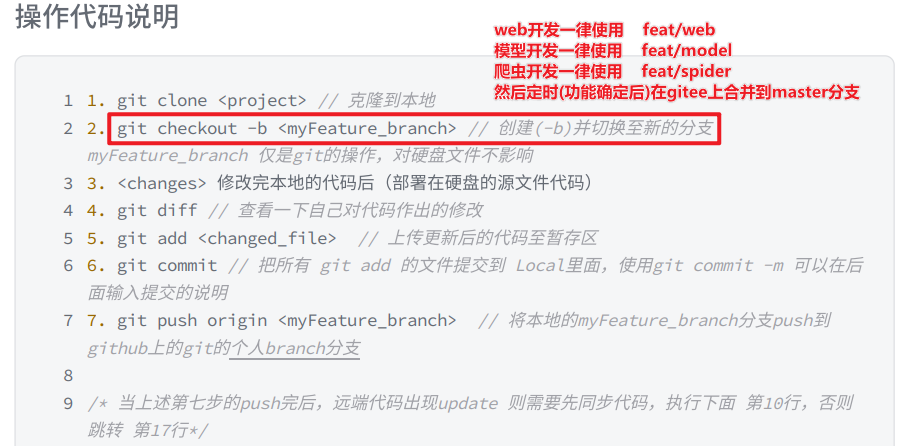

# 5G-phone-ReviewAnalyse
5G手机评价分析
> 注意事项
> 1. 使用规范的git操作，让代码仓库更简洁、让代码管理更高效
> 2. 先认真查看《git工作流及撤销操作.pdf》文件
> 3. 对于不同功能的开发，使用不同的分支名，最后功能确定再合并到master分支
>    1. web开发一律使用    feat/web `git checkout -b feat/web`
>    2. 模型开发一律使用    feat/model `git checkout -b feat/model`
>    3. 爬虫开发一律使用    feat/spider `git checkout -b feat/spider`
>    4. 然后定时(功能确定后)在gitee上合并到master分支
> 
> 5. 然后通过《git工作流图文教学.pdf》文件实际操作
> 6. 认真完成自己的分工

## 项目思路
1. 对于数据部分，个人认为有两个方向，标记数据和不标记数据
   1. 标记数据：爬取的评论只爬评价和星级，不用爬取追评，用1-3星定义为差评 4-5星定义为好评。模型在训练的过程中向着最优解靠近。
   2. 不标记数据：爬取的评论统称为一个“数据”，通过特定的 好评词集 和 坏评词集 来划分出评论中指出的优势和劣势。
   3. 简单来说，项目背景要求的是“汇总后得出各款手机的优点和缺点”，所以我认为可以用1星的定义为差评，5星的定义为好评，然后喂给模型，让它拟合一个好的识别率，然后当模型训练好后，对剩下的数据进行识别（输出好评为1，差评为0），然后用分词工具把这些好评和差评中的词划分后进行统计，得出一个词云；大概应该就完成任务了，剩下就是软件工程的开发流程的文档编写。
2. 爬虫部分
   1. 爬取评论的内容、星级、时间、ip地址(如果有)、平台类型，不需要追评（追评可能出现好评转差评的情况）
      1. 可自行补充，尽量以添加内容为主，不要爬少了
   2. 

## 小组分工
### 爬虫小分组
1. 人员：林乔瀚

### 建模小分组
1. 人员：李嘉華、周俊、莫森华
2. 模型搭建文章(仅是github上收藏量多的项目，不代表一定效果好）：
   1. https://github.com/gekelly/JD-Comment_emotional-analysis
      1. 注：图床没了，看不了效果，但是思路很好
   2. https://github.com/AimeeLee77/senti_analysis
      1. 也是没效果图，但是README文档较为详细
3. 文本预处理
   1. 前期的文本预处理(数据清理等)可以参考：https://blog.csdn.net/HUXINY/article/details/120014115
   2. 评论的标记：
   3. 中文分词：“借鉴” https://github.com/fxsjy/jieba
   4. 去除停用词：“借鉴” https://github.com/goto456/stopwords

### 网站搭建小分组
1. 人员：康文豪

## 可行性分析
> 成立项目小组并选定项目组长，组长召集小组成员选择开发项目，开展项目可行性研究
> 在可行性分析阶段，您需要对以下几个方面进行分析和评估：

- 技术可行性：分析您的项目是否有足够的技术条件和能力，如爬虫技术、分词技术、分类技术等，以及是否有合适的软件开发工具、平台和环境。
- 经济可行性：分析您的项目是否有足够的经济条件和效益，如项目的成本、收入、投资回收期等，以及是否符合市场需求和竞争优势。
- 法律可行性：分析您的项目是否符合相关的法律法规和政策，如网站的版权、隐私、数据安全等，以及是否有必要申请专利或授权。
- 社会可行性：分析您的项目是否符合社会的期望和价值，如项目的目标、意义、影响等，以及是否有利于社会的发展和进步。

> 您可以根据以上四个方面，收集和整理相关的数据和信息，进行定量和定性的分析，比较不同的方案，得出最终的结论和建议。这样就完成了可行性分析的基本内容和步骤

## 项目计划
> 项目组长召集小组成员，针对所选项目讨论开发计划，进一步明确项目的大小，范围，复杂程度等。并进行任务分解与任务分配，确定任务进度，确定完成项目的环境和工具

## 需求分析
> 按照项目任务分配结果和项目进度要求，由任务承担人开展项目的需求分析的主要工作,不得超越前述项目的大小，范围，复杂程度等。
> 
> 项目小组的其他成员配合任务承担人，完成项目的需求分析。

## 概要设计
> 按照项目任务分配结果和项目进度要求并依据《需求分析规格说明》，由任务承担人完成项目的概要设计任务，项目小组的其他成员配合任务承担人，完项目的概要设计任务。

## 详细设计
> 按照项目任务分配结果和项目进度要求并依据《概要设计文档》由任务承担人完成项目的详细设计任务。
> 
> 项目小组的其他成员配合任务承担人完成项目的详细设计任务。

## 编码
> 此阶段的主要任务是根据详细设计说明书，选定一门熟悉的编程语言（如：C++、JAVA或其他的）进行编码。要求编码过程中，应该依据编码规范，命名规范等相关规范开展编码工作，源代码需有适当的注释

## 测试
> 要求学习并掌握开发环境所提供的调试工具，能够阅读在线帮助。在此基础之上，应根据系统的需求设计相应的测试数据方案（特别是一些异常情况的处理），最终完成该系统的测试和调试任务。并要写出相应的测试说明书

# 课设选题的原则和要求
> 参加课程设计的学生首先要了解设计的任务，仔细阅读各个课题的设计要求，然后根据自己的基础和能力情况选择其中一题，或者由指导教师指定。  
> 
> 一般来说，选择课题应以在规定的时间内能完成，并能得到应有的锻炼为原则。

# 课设时间（待定）
|   学期   | 具体时间  |   时长    |          内容           | 组织方  |
|:------:|:-----:|:-------:|:---------------------:|:----:|
| 第二学期初  | 3月-4月 |    0    | 课程设计宣导/课题选定/导师分配/小组组建 | 合作公司 |
| 第二学期中旬 | 4月中下旬 |    0    |    分组、技术介绍、工具语言介绍     | 合作公司 |
|  第二学期  | 4月-6月 | 3 Month |        导师集中辅导         | 合作公司 |
| 第二学期下旬 |  6月   | 1 Week  |     作品演示、汇报，分数评定      | 合作公司 |

#  课设成绩考核及奖励
> 由校内和校外指导教师根据学生完成任务的情况、课程设计说明书的质量和课程设计过程中的工作态度等综合打分。在成绩评定中应成立由1名及以上具有讲师及以上职称的教师和字节跳动公司1名以上的技术专家组成的答辩小组，对学生进行答辩考核。
> 
> 课程设计结束时，要求学生写出课程设计报告（学校要求），需求说明书、设计文档和测试文档。课程设计报告主要说明小组成员、各人分工、选题及完成的内容和完成效果等。
> 
> 可运行的软件系统（包括源程序）。成绩评定实行优、良、中、及格和不及格五个等级。即：优秀—90～100分；良好—80～89分；中等—70～79分；及格—60～69分；不及格－60分以下。
> 
> 优秀者人数一般不得超过总人数的20%。不及格者不能得到相应的学分，需重新做课程设计。